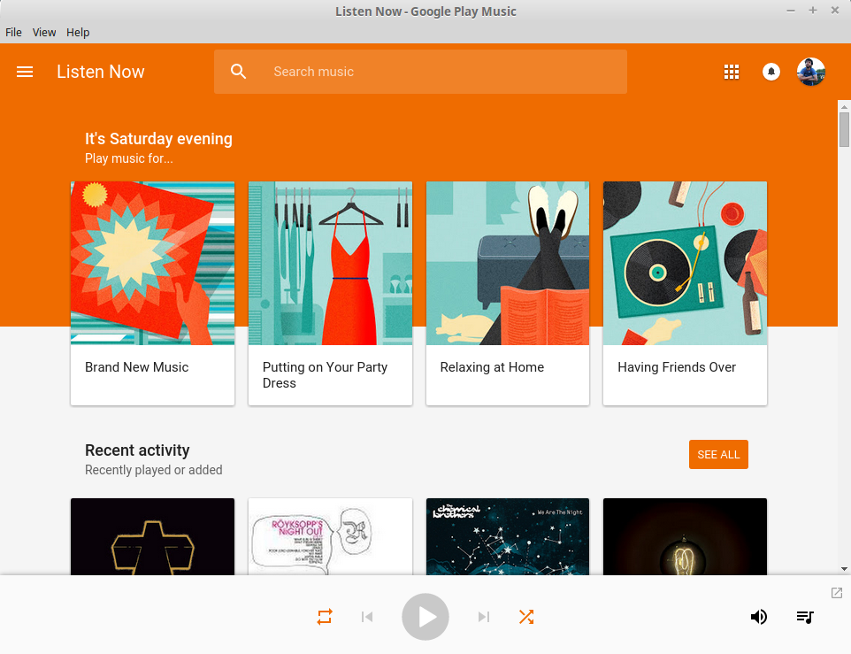
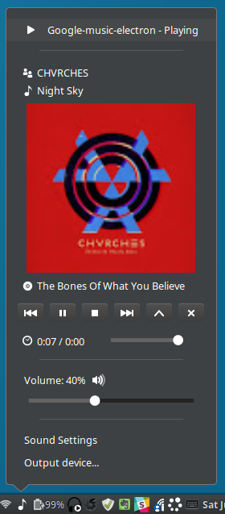

# google-music-electron [](https://travis-ci.org/twolfson/google-music-electron)

Desktop app for [Google Music][] on top of [Electron][]

**Features:**

- Google Music as a standalone application
- Tray for quick play/pause/quit and tooltip with information
- Media key shortcuts
- MPRIS integration (for GNU/Linux desktop environments)



This was written as a successsor to [google-music-webkit][]. When upgrading between versions of [nw.js][], there were regressions with taskbar and shortcut bindings. We wrote this as an alternative.

[Google Music]: https://play.google.com/music/listen
[Electron]: http://electron.atom.io/
[google-music-webkit]: https://github.com/twolfson/google-music-webkit
[nw.js]: https://github.com/nwjs/nw.js

## Requirements
- [npm][], usually installed with [node][]

[npm]: http://npmjs.org/
[node]: http://nodejs.org/

## Getting Started
`google-music-electron` can be installed globally via `npm`:

```js
# Install google-music-electron via npm
npm install -g google-music-electron

# Run google-music-electron
google-music-electron
```

When the application has launched, it will appear in your taskbar and via a tray icon, .


### MPRIS integration
If you are on GNU/Linux and your desktop environment supports [MPRIS][], you can install our [MPRIS][] integration via:

```bash
google-music-electron install-mpris
# Once this succeeds, MRPIS will be integrated on `google-music-electron` restart
```



## Updating
`google-music-electron` can be updated via `npm`:

```js
# Update google-music-electron to a newer version via npm
npm update -g google-music-electron
# Alternatively, the following can be used as well to specify a version
# npm install -g google-music-electron@latest
```

## Documentation
### CLI
We have a few CLI options available for you:

```
  Usage: google-music-electron [options]

  Options:

    -h, --help          output usage information
    -V, --version       output the version number
    -S, --skip-taskbar  Skip showing the application in the taskbar
    --minimize-to-tray  Hide window to tray instead of minimizing
    --hide-via-tray     Hide window to tray instead of minimizing (only for tray icon)
    --verbose           Display verbose log output in stdout
    --debug-repl        Starts a `replify` server as `google-music-electron` for debugging
```

## Development
### Running locally
To get a local development copy running, you will need:

- [npm][], usually installed with [node][]. Same `npm` that is used during installation
- [git][], version control tool

[git]: http://git-scm.com/

Follow the steps below to get a development copy set up:

```bash
# Clone our repository
git clone https://github.com/twolfson/google-music-electron.git
cd google-music-electron/

# Install our dependencies and dev dependencies
npm install

# Start up `google-music-electron`
npm start
```

After running the above steps, a copy of `google-music-electron` should begin running.


#### Adding local setup as a global installation
After getting our local development set up, we can go one step further and get `google-music-electron` working on our CLI as if it were installed via `npm install -g`.

```bash
# Link local copy as a global copy
# WARNING: Make sure that `npm install` has been run before this point
#   or your local copy's permissions may get messed up
npm link

# Run `google-music-electron` for local copy
google-music-electron
```

More information on `npm link` can be found in `npm's` documentation:

https://docs.npmjs.com/cli/link

### Icons
Source images are kept in the `resources/` folder. Icons are maintained via Inkscape and the `play/pause` buttons are isolated in layers.

To generate icons:

1. Export each of the play/pause/clean variants as a `.svg` file
2. Load the icons via GIMP as a 32x32 SVG
3. Export via GIMP as a `.png`

At the time of writing, Inkscape and Image Magick seemed to be generating non-transparent backgrounds upon converting SVG to PNG.

## Contributing
In lieu of a formal styleguide, take care to maintain the existing coding style. Add unit tests for any new or changed functionality. Lint via `npm run lint` and test via `npm test`.

## Donating
Support this project and [others by twolfson][gratipay] via [gratipay][].

[![Support via Gratipay][gratipay-badge]][gratipay]

[gratipay-badge]: https://cdn.rawgit.com/gratipay/gratipay-badge/2.x.x/dist/gratipay.png
[gratipay]: https://www.gratipay.com/twolfson/

## Attribution
Headphones designed by Jake Dunham from [the Noun Project][headphones-icon]

[headphones-icon]: http://thenounproject.com/term/headphones/16097/

## Unlicense
As of May 16 2015, Todd Wolfson has released this repository and its contents to the public domain.

It has been released under the [UNLICENSE][].

[UNLICENSE]: UNLICENSE
